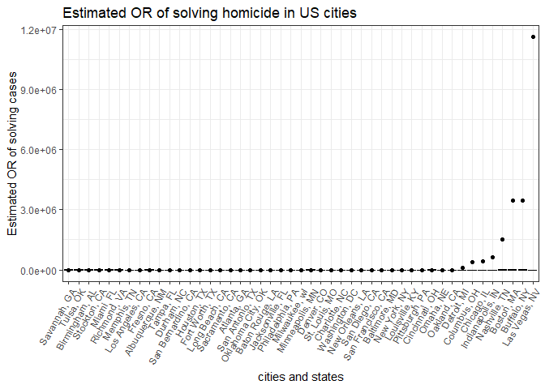
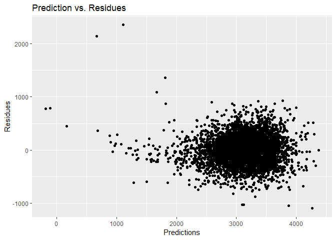
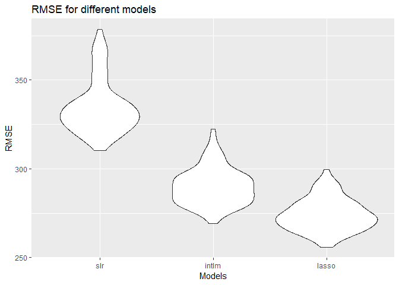

p8105\_hw6\_yl3181
================
Yuelin Long
November 20, 2018

Problem 1
---------

``` r
#Load libraries needed
library(tidyverse)
```

    ## -- Attaching packages ------------------------------------------------------------------------------------- tidyverse 1.2.1 --

    ## v ggplot2 3.0.0     v purrr   0.2.5
    ## v tibble  1.4.2     v dplyr   0.7.7
    ## v tidyr   0.8.1     v stringr 1.3.1
    ## v readr   1.1.1     v forcats 0.3.0

    ## -- Conflicts ---------------------------------------------------------------------------------------- tidyverse_conflicts() --
    ## x dplyr::filter() masks stats::filter()
    ## x dplyr::lag()    masks stats::lag()

``` r
library(modelr)
library(MASS)
```

    ## 
    ## Attaching package: 'MASS'

    ## The following object is masked from 'package:dplyr':
    ## 
    ##     select

``` r
# Load data and tidy it
homi = read_csv("homicide-data.csv") %>% 
  mutate(city_state = str_c(city, state, sep = ", "), 
         bin_sol = (disposition == "Closed by arrest"),
         victim_age = replace(victim_age, victim_age == "Unknown", ""),
         victim_age = as.numeric(victim_age),
         victim_sex = replace(victim_sex, victim_sex == "Unknown", ""),
         victim_race = replace(victim_race, victim_race == "Unknown", ""),
         bin_race = ifelse(victim_race == "White", "white", ifelse(victim_race == "", "","nonwhite")),
         bin_race = relevel(factor(bin_race), "white")) %>% 
  filter(!(city_state %in% c("Dallas, TX", "Phoenix, AZ", "Kansas City, MO", "Tulsa, AL"))) 
```

    ## Parsed with column specification:
    ## cols(
    ##   uid = col_character(),
    ##   reported_date = col_integer(),
    ##   victim_last = col_character(),
    ##   victim_first = col_character(),
    ##   victim_race = col_character(),
    ##   victim_age = col_character(),
    ##   victim_sex = col_character(),
    ##   city = col_character(),
    ##   state = col_character(),
    ##   lat = col_double(),
    ##   lon = col_double(),
    ##   disposition = col_character()
    ## )

``` r
# Fit logistic regression and save it
sol_fit_Bal = homi %>% 
  filter(city_state == "Baltimore, MD") %>% 
  glm(bin_sol ~ victim_age + bin_race + victim_sex, data = ., family = binomial())

  
# Clean results and add estimates and CIs for ORs. OR = exp(b1)
sol_fit_Bal %>% 
  broom::tidy() %>% 
  cbind(exp(confint(sol_fit_Bal))) %>% 
  mutate(OR = exp(estimate)) %>% 
  filter(term == "bin_racenonwhite") %>% 
  knitr::kable()
```

    ## Waiting for profiling to be done...

| term              |    estimate|  std.error|  statistic|  p.value|      2.5 %|     97.5 %|        OR|
|:------------------|-----------:|----------:|----------:|--------:|----------:|----------:|---------:|
| bin\_racenonwhite |  -0.8195997|  0.1746156|  -4.693738|  2.7e-06|  0.3121625|  0.6196693|  0.440608|

``` r
# Build logistic regression for every cities, generate adjusted ORs and CIs.
sol_fit = homi %>%
  dplyr::select(city_state, bin_sol, victim_age, bin_race, victim_sex) %>% 
  group_by(city_state) %>% 
  nest() %>% 
  mutate(model = purrr::map(.x = data, .f = ~broom::tidy(glm(bin_sol ~ ., data = .x, family = binomial())))) %>% 
  .[,-2] %>% 
  unnest() %>% 
  filter(term == "bin_racenonwhite") %>% 
  mutate(OR = exp(estimate),
         lwconf = exp(estimate - std.error * 1.96),
         upconf = exp(estimate + std.error * 1.96))

sol_fit %>% 
  ggplot(aes(x = fct_reorder(city_state, OR), y = OR)) + 
  geom_point() + 
  geom_errorbar(aes(ymin = lwconf, ymax = upconf)) +
  labs(
    title = "Estimated OR of solving homicide in US cities",
    x = "cities and states",
    y = "Estimated OR of solving cases"
  ) + 
  theme_bw() +
  theme(axis.text.x = element_text(angle = 60, hjust = 1))
```



Problem 2
---------

``` r
bw = read_csv("birthweight.csv") %>% 
  mutate(babysex = as.factor(babysex),
         frace = as.factor(frace),
         malform = as.factor(malform),
         mrace = as.factor(mrace))
```

    ## Parsed with column specification:
    ## cols(
    ##   .default = col_integer(),
    ##   gaweeks = col_double(),
    ##   ppbmi = col_double(),
    ##   smoken = col_double()
    ## )

    ## See spec(...) for full column specifications.

### First Model

-   Most values for variable parity, pnumlbw and pnumsga are 0, therefore they won't be included in the following models;
-   Using caret to build penalized regression model (lasso) using all the other main effects;
-   Preprocess the model variables with centering and scaling;
-   Use cross validation to tune parameters;

``` r
# Build a model includes all main effects except for parity, pnumlbw and pnumsga with caret
library(caret)
```

    ## Loading required package: lattice

    ## 
    ## Attaching package: 'caret'

    ## The following object is masked from 'package:purrr':
    ## 
    ##     lift

``` r
# Use 5-fold validation and create the training sets

data_train = trainControl(method = "cv", number = 5)

# Write a function for the lasso model with all the other main effects with preprocessing and cv
lasso_fun = function(df){
  
newdf = df %>% 
  dplyr::select(-parity, -pnumlbw, -pnumsga) %>% 
  train(bwt ~ ., data = .,
        trControl = data_train,
        method = 'lasso',
        preProc = c("center", "scale"),
        na.action = na.pass)
return(newdf)
  }

#Apply the function to birthweight data and draw a plot on residuals against fitted values  
bw %>% 
  add_predictions(lasso_fun(bw)) %>% 
  add_residuals(lasso_fun(bw)) %>% 
  ggplot(aes(x = pred, y = resid)) + geom_point() +
  labs(
    title = "Prediction vs. Residues",
    x = "Predictions",
    y = "Residues"
  )
```



### Compare lasso with other two models

``` r
# Build three different models
cv_data = crossv_mc(bw, 100) %>% 
  mutate(train = map(train, as_tibble),
         test = map(test, as_tibble)) %>% 
  mutate(slr   = map(train, ~lm(bwt ~ blength + gaweeks, data = .x)),
         intlm = map(train, ~lm(bwt ~ (bhead + blength + babysex)^3, data = .x)),
         lasso = map(train, ~lasso_fun(.x))) %>% 
  mutate(rmse_slr    = map2_dbl(slr, test, ~rmse(model = .x, data = .y)),
         rmse_intlm  = map2_dbl(intlm, test, ~rmse(model = .x, data = .y)),
         rmse_lasso  = map2_dbl(lasso, test, ~rmse(model = .x, data = .y)))

# Plot RMSE for different three models 
cv_data %>% 
  dplyr::select(starts_with("rmse")) %>% 
  gather(key = model, value = rmse) %>% 
  mutate(model = str_replace(model, "rmse_", ""),
         model = fct_inorder(model)) %>% 
  ggplot(aes(x = model, y = rmse)) + geom_violin() +
  labs(
    title = "RMSE for different models",
    x = "Models",
    y = "RMSE"
  )
```


