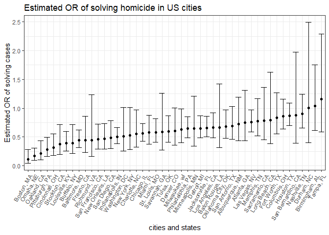

p8105\_hw6\_yl3181
================
Yuelin Long
November 20, 2018

Problem 1
---------

``` r
#Load libraries needed
library(tidyverse)
```

    ## -- Attaching packages ------------------------------------------------------------------------------------- tidyverse 1.2.1 --

    ## v ggplot2 3.0.0     v purrr   0.2.5
    ## v tibble  1.4.2     v dplyr   0.7.7
    ## v tidyr   0.8.1     v stringr 1.3.1
    ## v readr   1.1.1     v forcats 0.3.0

    ## -- Conflicts ---------------------------------------------------------------------------------------- tidyverse_conflicts() --
    ## x dplyr::filter() masks stats::filter()
    ## x dplyr::lag()    masks stats::lag()

``` r
library(modelr)
library(MASS)
```

    ## 
    ## Attaching package: 'MASS'

    ## The following object is masked from 'package:dplyr':
    ## 
    ##     select

``` r
# Load data and tidy it
homi = read_csv("homicide-data.csv") %>% 
  mutate(city_state = str_c(city, state, sep = ", "), 
         bin_sol = (disposition == "Closed by arrest"),
         victim_age = replace(victim_age, victim_age == "Unknown", ""),
         victim_age = as.numeric(victim_age),
         victim_sex = replace(victim_sex, victim_sex == "Unknown", ""),
         victim_race = replace(victim_race, victim_race == "Unknown", ""),
         bin_race = ifelse(victim_race == "White", "white", ifelse(victim_race == "", "","nonWhite"))) %>% 
  filter(!(city_state %in% c("Dallas, TX", "Phoenix, AZ", "Kansas City, MO", "Tulsa, AL"))) 
```

    ## Parsed with column specification:
    ## cols(
    ##   uid = col_character(),
    ##   reported_date = col_integer(),
    ##   victim_last = col_character(),
    ##   victim_first = col_character(),
    ##   victim_race = col_character(),
    ##   victim_age = col_character(),
    ##   victim_sex = col_character(),
    ##   city = col_character(),
    ##   state = col_character(),
    ##   lat = col_double(),
    ##   lon = col_double(),
    ##   disposition = col_character()
    ## )

``` r
# Fit logistic regression and save it
sol_fit_Bal = homi %>% 
  filter(city_state == "Baltimore, MD") %>% 
  glm(bin_sol ~ victim_age + bin_race + victim_sex, data = ., family = binomial())

  
# Clean results and add estimates and CIs for ORs. OR = exp(b1)
sol_fit_Bal %>% 
  broom::tidy() %>% 
  cbind(exp(confint(sol_fit_Bal))) %>% 
  mutate(OR = exp(estimate)) %>% 
  filter(term == "bin_racewhite") %>% 
  knitr::kable()
```

    ## Waiting for profiling to be done...

| term           |   estimate|  std.error|  statistic|  p.value|     2.5 %|   97.5 %|        OR|
|:---------------|----------:|----------:|----------:|--------:|---------:|--------:|---------:|
| bin\_racewhite |  0.8195997|  0.1746156|   4.693738|  2.7e-06|  1.613764|  3.20346|  2.269591|

``` r
# Build logistic regression for every cities, generate adjusted ORs and CIs.
sol_fit = homi %>%
  dplyr::select(city_state, bin_sol, victim_age, bin_race, victim_sex) %>% 
  group_by(city_state) %>% 
  nest() %>% 
  mutate(model = purrr::map(.x = data, .f = ~broom::tidy(glm(bin_sol ~ ., data = .x, family = binomial())))) %>% 
  .[,-2] %>% 
  unnest() %>% 
  filter(term == "bin_racewhite") %>% 
  mutate(OR = exp(estimate),
         lwconf = estimate - std.error * 1.96,
         upconf = estimate + std.error * 1.96) 

sol_fit %>% 
  ggplot(aes(x = fct_reorder(city_state, OR), y = OR)) + 
  geom_point() + 
  geom_errorbar(aes(ymin = lwconf, ymax = upconf)) +
  labs(
    title = "Estimated OR of solving homicide in US cities",
    x = "cities and states",
    y = "Estimated OR of solving cases"
  ) + 
  theme_bw() +
  theme(axis.text.x = element_text(angle = 60, hjust = 1))
```


